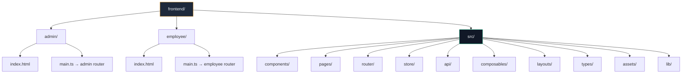

# 📂 Frontend Folder Structure — Analysis & Review

> **Project**: Attendance App v4  
> **Stack**: Vue 3 (Script Setup + TS) · Tailwind CSS v4 · Shadcn-vue · Pinia · Vite 8  
> **Date**: 2026-05-05

---

## 1. Architecture Overview

The frontend uses a **multi-entry point SPA** pattern — a single `src/` codebase serves two distinct applications (**Admin** and **Employee**) via separate Vite configs, entry HTML files, and routers.



### Entry Point Flow

| App | Entry HTML | Entry TS | Vite Config | Port | Base URL |
|---|---|---|---|---|---|
| Admin | `admin/index.html` | `admin/main.ts` | `vite.config.admin.ts` | 5173 | `/admin/` |
| Employee | `employee/index.html` | `employee/main.ts` | `vite.config.employee.ts` | 5174 | `/employee/` |
| Default | `index.html` | `src/main.ts` | `vite.config.ts` | 5173 | `/` |

---

## 2. Full Directory Tree

```
frontend/
├── admin/                          # Admin entry point
│   ├── index.html
│   └── main.ts
├── employee/                       # Employee entry point
│   ├── index.html
│   └── main.ts
├── src/
│   ├── api/
│   │   └── axios.ts                # Axios instance + interceptors
│   ├── assets/
│   │   ├── base.css                # Design token system (412 lines)
│   │   └── main.css                # Tailwind + Shadcn integration
│   ├── components/
│   │   ├── admin/                  # 6 admin-specific components
│   │   │   ├── AdminAvatar.vue
│   │   │   ├── AdminBadge.vue
│   │   │   ├── AdminCard.vue
│   │   │   ├── AdminEmptyState.vue
│   │   │   ├── AdminSidebar.vue
│   │   │   └── AdminTable.vue
│   │   ├── employee/               # 4 employee-specific components
│   │   │   ├── EmployeeBadge.vue
│   │   │   ├── EmployeeCard.vue
│   │   │   ├── EmployeeSkeleton.vue
│   │   │   └── EmployeeTabBar.vue
│   │   ├── icons/                  # 5 Vue scaffold icon files (UNUSED?)
│   │   │   ├── IconCommunity.vue
│   │   │   ├── IconDocumentation.vue
│   │   │   ├── IconEcosystem.vue
│   │   │   ├── IconSupport.vue
│   │   │   └── IconTooling.vue
│   │   └── ui/                     # 8 Shadcn-vue primitives
│   │       ├── avatar/
│   │       ├── badge/
│   │       ├── button/
│   │       ├── card/
│   │       ├── separator/
│   │       ├── skeleton/
│   │       ├── table/
│   │       └── tabs/
│   ├── composables/
│   │   ├── useGeolocation.ts
│   │   ├── useNotifications.ts
│   │   ├── useTheme.ts
│   │   └── useWebAuthn.ts
│   ├── layouts/
│   │   ├── AdminLayout.vue
│   │   └── EmployeeLayout.vue
│   ├── lib/
│   │   └── utils.ts                # cn() helper
│   ├── pages/
│   │   ├── RegisterPage.vue
│   │   ├── admin/                  # 7 admin page views
│   │   │   ├── AdminLoginPage.vue
│   │   │   ├── AttendancePage.vue
│   │   │   ├── DashboardPage.vue
│   │   │   ├── EmployeesPage.vue
│   │   │   ├── PayrollPage.vue
│   │   │   ├── ReportsPage.vue
│   │   │   └── SettingsPage.vue
│   │   └── employee/               # 9 employee page views
│   │       ├── ClockPage.vue
│   │       ├── DashboardPage.vue
│   │       ├── DisplaySettings.vue
│   │       ├── EmployeeLoginPage.vue
│   │       ├── HistoryPage.vue
│   │       ├── NotificationSettings.vue
│   │       ├── ProfilePage.vue
│   │       ├── SecuritySettings.vue
│   │       └── SettingsPage.vue
│   ├── router/
│   │   ├── admin.ts
│   │   └── employee.ts
│   ├── store/
│   │   └── auth.ts                 # Single Pinia store
│   └── types/
│       └── auth.ts                 # All domain interfaces
├── .env.production
├── components.json                 # Shadcn-vue config
├── package.json
├── tailwind.config.js
├── vite.config.ts
├── vite.config.admin.ts
└── vite.config.employee.ts
```

---

## 3. Pros ✅

### 3.1 Multi-Entry Architecture
- **Separate builds** for admin and employee — each app only ships code it needs, reducing bundle size significantly.
- **Independent deployment** — admin panel can be deployed to a different subdomain or behind a VPN without affecting the employee PWA.
- Uses `__APP_CONTEXT__` define to disambiguate at build time.

### 3.2 Strong Design Token System
- [base.css](file:///c:/Attendance_Apps%20v4/frontend/src/assets/base.css) is a **comprehensive 412-line design token system** covering backgrounds, borders, text, accent, semantic colors, shadows, radii, and typography.
- Full **light/dark theme support** with a clean CSS variable swap pattern.
- **Role-specific theming** — admin gets emerald accent, employee gets amber. Login pages have entirely distinct design identities (admin = "Command Center", employee = "Warm Clock-In").
- Design tokens are bridged into Tailwind via [tailwind.config.js](file:///c:/Attendance_Apps%20v4/frontend/src/../../../frontend/tailwind.config.js), keeping a single source of truth.

### 3.3 Good Composable Architecture
- Well-structured composables for cross-cutting concerns: `useTheme`, `useGeolocation`, `useNotifications`, `useWebAuthn`.
- Each composable is **self-contained** with its own storage, state, and error handling.
- Theme composable handles system preference detection and media query listeners properly.

### 3.4 Type Safety
- All domain models (`User`, `Attendance`, `LeaveRequest`, `Payroll`, `ApiResponse`, `PaginatedResponse`) are centralized in [types/auth.ts](file:///c:/Attendance_Apps%20v4/frontend/src/types/auth.ts).
- Generic `ApiResponse<T>` and `PaginatedResponse<T>` patterns are reusable.
- Auth store uses proper TypeScript interfaces for credentials and responses.

### 3.5 API Layer
- Axios interceptors handle **automatic token attachment** and **silent refresh** with retry logic.
- Refresh token flow is implemented correctly with `_retry` flag to prevent infinite loops.
- Centralized `baseURL` configuration via environment variable.

### 3.6 PWA Support
- Employee app has **Vite PWA plugin** configured with service worker, manifest, offline support, and standalone display mode.
- PWA-optimized CSS reset with `safe-area-inset` padding and `100dvh` for mobile.

### 3.7 Shadcn-vue Integration
- Properly configured with `reka-nova` style, TypeScript, and `lucide` icon library.
- 8 UI primitives installed (avatar, badge, button, card, separator, skeleton, table, tabs).
- Aliases configured for clean imports.

### 3.8 Router Guards
- Both routers implement `beforeEach` guards with token + role checks.
- Catch-all 404 routes prevent blank screens.
- Lazy-loaded routes via dynamic `import()` for code-splitting.

---

## 4. Cons ❌

### 4.1 🔴 Massive Page Components (Critical)

The biggest problem — **pages are monolithic** and far too large:

| Page | Lines | Size | Severity |
|---|---|---|---|
| `admin/SettingsPage.vue` | **947** | 31.7 KB | 🔴 Critical |
| `employee/ProfilePage.vue` | **918** | 29.2 KB | 🔴 Critical |
| `employee/ClockPage.vue` | **872** | 23.0 KB | 🔴 Critical |
| `admin/EmployeesPage.vue` | **717** | 24.6 KB | 🔴 Critical |
| `admin/AdminLoginPage.vue` | **702** | 16.6 KB | 🟠 High |
| `employee/HistoryPage.vue` | **699** | 20.6 KB | 🟠 High |
| `admin/PayrollPage.vue` | **698** | 28.5 KB | 🟠 High |
| `employee/SettingsPage.vue` | **685** | 17.3 KB | 🟠 High |
| `admin/AttendancePage.vue` | **645** | 30.9 KB | 🟠 High |

> [!CAUTION]
> A single Vue component should ideally be **under 200–300 lines**. Multiple pages exceed **700+ lines**, combining templates, scripts, and styling in one file. This makes them extremely hard to maintain, test, and review.

### 4.2 🔴 Duplicate Entry Points (Confusing)

There are **three** levels of entry bootstrapping that overlap:

```
src/main.ts          → generic, picks router based on __APP_CONTEXT__
src/main-admin.ts    → hardcoded admin router
src/main-employee.ts → hardcoded employee router
admin/main.ts        → ALSO hardcoded admin router (references ../src/)
employee/main.ts     → ALSO hardcoded employee router (references ../src/)
```

> [!WARNING]
> 5 entry files for 2 apps is excessive. `src/main.ts`, `src/main-admin.ts`, and `src/main-employee.ts` appear unused since `admin/main.ts` and `employee/main.ts` are the real entry points referenced by their respective `index.html` files. Dead code creates confusion.

### 4.3 🟠 Leftover Scaffold Files

The following files are **Vue CLI scaffolding defaults** that were never cleaned up:

- `src/components/HelloWorld.vue`
- `src/components/TheWelcome.vue`
- `src/components/WelcomeItem.vue`
- `src/components/icons/IconCommunity.vue`
- `src/components/icons/IconDocumentation.vue`
- `src/components/icons/IconEcosystem.vue`
- `src/components/icons/IconSupport.vue`
- `src/components/icons/IconTooling.vue`

These 8 files add noise and show the project wasn't properly cleaned after initialization.

### 4.4 🟠 Misnamed Types File

All domain types live in [types/auth.ts](file:///c:/Attendance_Apps%20v4/frontend/src/types/auth.ts), but the file contains `Attendance`, `LeaveRequest`, `Payroll`, `GeofenceLocation`, `ClockInRequest`, `ClockOutRequest` — only ~15% is actually auth-related.

### 4.5 🟠 Single Pinia Store

The entire app has **only one store** (`auth.ts`). This means:
- No dedicated stores for attendance, employees, payroll, settings, or notifications.
- All data fetching and state management is likely embedded **inside page components**, contributing to the bloated pages.

### 4.6 🟠 Single API File

`api/axios.ts` contains the Axios instance and interceptors but there are **no service modules** (e.g., `api/attendance.ts`, `api/employees.ts`, `api/payroll.ts`). API calls are likely scattered across page components with inline `apiClient.get(...)` calls.

### 4.7 🟡 Dual Design Token Systems

Two competing CSS variable systems exist side by side:

| System | File | Purpose |
|---|---|---|
| Custom tokens | `base.css` | `--bg-primary`, `--accent`, `--text-muted`, etc. |
| Shadcn tokens | `main.css` | `--background`, `--foreground`, `--primary`, `--card`, etc. |

Both define `--border`, `--accent`, `--card` variables but with **different values**. The Tailwind config only bridges the custom tokens, while Shadcn components consume the oklch-based tokens from `main.css`. This creates inconsistency.

### 4.8 🟡 Auth Guard Uses Raw localStorage

Router guards directly read `localStorage.getItem('auth_token')` instead of using the Pinia auth store. This creates a **dual source of truth** — the store might have a different auth state than what the router guard checks.

### 4.9 🟡 Missing Shared Components

Both admin and employee apps have their own `Badge`, `Card`, and `Settings` components with likely overlapping logic. There's no `components/shared/` directory for truly reusable cross-app components.

### 4.10 🟡 No Error Boundary or Global Error Handling

No error boundary component, no global error handler, no toast/notification system at the app level. Errors are handled ad-hoc in each page.

### 4.11 🟡 hardcoded redirect in Axios interceptor

The 401 handler in `axios.ts` does `window.location.href = '/login'`, which breaks the multi-entry architecture since admin lives at `/admin/login` and employee at `/employee/login`.

---

## 5. Scoring Summary

| Category | Score | Notes |
|---|---|---|
| **Folder Organization** | ⭐⭐⭐⭐ | Clean separation of concerns by role. Good use of directories. |
| **Design System** | ⭐⭐⭐⭐ | Comprehensive tokens, but dual systems cause friction. |
| **Component Architecture** | ⭐⭐ | Pages are monolithic. Very few reusable components beyond Shadcn UI. |
| **State Management** | ⭐⭐ | Only auth store. No separation of domain state. |
| **API Layer** | ⭐⭐⭐ | Good interceptors, but no service layer abstraction. |
| **Type Safety** | ⭐⭐⭐⭐ | Good types defined, just poorly organized. |
| **Routing** | ⭐⭐⭐⭐ | Lazy loading, guards, 404 handling all present. |
| **Build Setup** | ⭐⭐⭐⭐ | Multi-entry Vite with PWA, but redundant configs. |
| **Code Cleanliness** | ⭐⭐ | Scaffold leftovers, dead entry points, inconsistencies. |
| **Overall** | **⭐⭐⭐ (3/5)** | Solid foundation but needs significant refactoring to scale. |

---

## 6. Improvement Roadmap

### 🔴 Priority 1 — Decompose Giant Pages

Break each 500+ line page into smaller child components. Example for `admin/SettingsPage.vue` (947 lines):

```
pages/admin/SettingsPage.vue (< 100 lines, orchestrator only)
  └── components/admin/settings/
       ├── GeneralSettings.vue
       ├── GeofenceSettings.vue
       ├── WorkScheduleSettings.vue
       ├── NotificationSettings.vue
       └── SecuritySettings.vue
```

### 🔴 Priority 2 — Create API Service Modules

```
api/
  ├── axios.ts              # Keep as-is
  ├── auth.service.ts       # login, register, logout, refreshToken
  ├── attendance.service.ts # clockIn, clockOut, getHistory
  ├── employees.service.ts  # list, create, update, delete
  ├── payroll.service.ts    # calculate, approve, getReports
  └── settings.service.ts   # getSettings, updateSettings
```

### 🟠 Priority 3 — Add Domain Pinia Stores

```
store/
  ├── auth.ts               # Keep (already exists)
  ├── attendance.ts          # Today's status, clock state
  ├── employees.ts           # Employee list + pagination
  ├── payroll.ts             # Payroll data + filters
  ├── notifications.ts       # Push notification state
  └── ui.ts                  # Sidebar state, modals, toasts
```

### 🟠 Priority 4 — Clean Up Dead Code

- Delete `src/main.ts`, `src/main-admin.ts`, `src/main-employee.ts` (entry points are in `admin/` and `employee/`)
- Delete all `components/icons/Icon*.vue` scaffold files
- Delete `HelloWorld.vue`, `TheWelcome.vue`, `WelcomeItem.vue`

### 🟡 Priority 5 — Unify Design Token System

Merge `base.css` custom tokens and `main.css` Shadcn tokens into a single coherent system. Either:
- Map Shadcn variables to your custom tokens, OR
- Migrate fully to Shadcn's oklch-based system

### 🟡 Priority 6 — Reorganize Types

```
types/
  ├── auth.ts        # User, LoginCredentials, RegisterData
  ├── attendance.ts  # Attendance, ClockInRequest, ClockOutRequest
  ├── payroll.ts     # Payroll
  ├── leave.ts       # LeaveRequest
  ├── geofence.ts    # GeofenceLocation
  └── api.ts         # ApiResponse<T>, PaginatedResponse<T>
```

### 🟡 Priority 7 — Fix Auth Guard Inconsistency

Use the Pinia store in router guards instead of raw `localStorage`:

```typescript
// Before (inconsistent)
const token = localStorage.getItem('auth_token')

// After (single source of truth)
const authStore = useAuthStore()
if (to.meta.requiresAuth && !authStore.isAuthenticated) { ... }
```

### 🟡 Priority 8 — Fix Hardcoded Login Redirect

```typescript
// Before (breaks multi-entry)
window.location.href = '/login'

// After (context-aware)
const base = import.meta.env.BASE_URL || '/'
window.location.href = `${base}login`
```

---

## 7. Conclusion

The frontend has a **solid architectural foundation** — the multi-entry pattern, design token system, and composable layer are well thought out. However, the project suffers from **execution-level issues**: bloated page components, missing service/store layers, duplicate configurations, and scaffold leftovers. The most impactful improvement would be decomposing the 10+ monolithic page files into smaller, reusable components backed by dedicated API services and Pinia stores.
