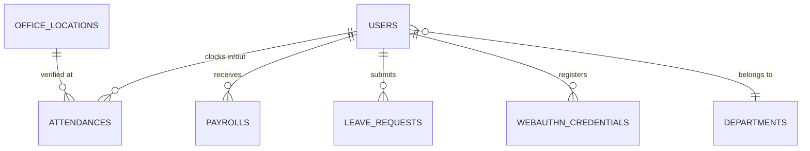
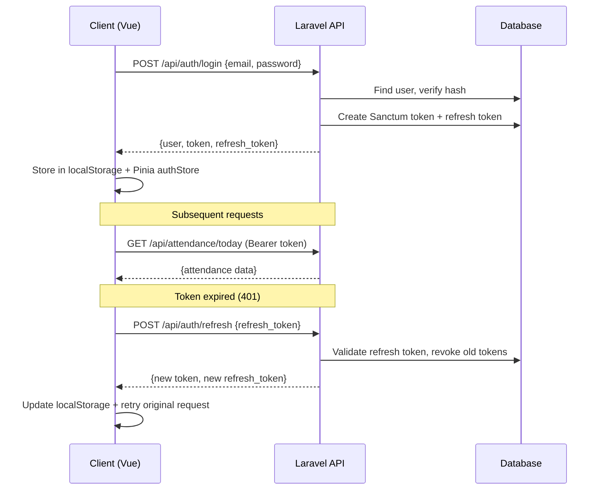

# 🏗️ Attendance App — Full Build Guide

> **Stack**: Laravel 13 (API) · Vue 3 + Vite · Tailwind CSS · Shadcn-vue · Pinia · Sanctum  
> **Architecture**: Decoupled — Laravel serves JSON API, Vue consumes it as two separate SPAs

---

## 1. System Architecture

```
┌─────────────────┐    ┌─────────────────┐    ┌──────────────────┐
│  Employee PWA   │    │  Admin Panel    │    │  Flutter Mobile  │
│  :5174          │    │  :5173          │    │  (optional)      │
│  /employee/*    │    │  /admin/*       │    │                  │
└────────┬────────┘    └────────┬────────┘    └────────┬─────────┘
         │                      │                      │
         └──────────────────────┼──────────────────────┘
                                │ HTTPS + Bearer Token
                     ┌──────────▼──────────┐
                     │   Laravel API :8080 │
                     │   /api/*            │
                     ├─────────────────────┤
                     │ Sanctum Auth        │
                     │ GeofenceService     │
                     │ PayrollService      │
                     ├─────────────────────┤
                     │ SQLite / MySQL      │
                     └─────────────────────┘
```

**Why two SPAs?** Admin and employee have different layouts, routes, PWA configs, and deployment targets. Separate Vite configs produce independent bundles — admin can go behind VPN while employee stays public.

---

## 2. Database Schema

### Entity Relationship



### Tables

#### `users`
| Column | Type | Notes |
|---|---|---|
| id | bigint PK | Auto-increment |
| name | varchar(255) | |
| email | varchar(255) | Unique |
| password | varchar(255) | Hashed |
| role | varchar(20) | `'employee'` \| `'admin'` |
| hourly_rate | decimal(10,2) | Nullable |
| department_id | FK → departments | Nullable |
| avatar | varchar(255) | Nullable |
| refresh_token | varchar(64) | For token refresh flow |

#### `departments`
| Column | Type | Notes |
|---|---|---|
| id | bigint PK | |
| name | varchar(255) | |
| code | varchar(10) | Unique short code |
| description | text | Nullable |
| is_active | boolean | Default true |

#### `office_locations`
| Column | Type | Notes |
|---|---|---|
| id | bigint PK | |
| name | varchar(255) | |
| address | text | |
| latitude | decimal(10,8) | GPS coordinate |
| longitude | decimal(11,8) | GPS coordinate |
| radius_meters | integer | Geofence radius |
| default_start_time | time | e.g. `09:00` |
| default_end_time | time | e.g. `18:00` |
| is_active | boolean | Only one active at a time |

#### `attendances`
| Column | Type | Notes |
|---|---|---|
| id | bigint PK | |
| user_id | FK → users | Cascade delete |
| office_location_id | FK → office_locations | Set null on delete |
| clock_in | timestamp | |
| clock_out | timestamp | Nullable until clock-out |
| lat_in / long_in | decimal | GPS at clock-in |
| lat_out / long_out | decimal | GPS at clock-out |
| status | enum | `present`, `late`, `absent`, `half_day` |
| total_hours | decimal(5,2) | Calculated on clock-out |
| notes | text | Nullable |
| device_id | varchar | For audit trail |
| biometric_verified | boolean | WebAuthn verified? |
| **Index** | | `(user_id, clock_in)` composite |

#### `payrolls`
| Column | Type | Notes |
|---|---|---|
| id | bigint PK | |
| user_id | FK → users | |
| month / year | integer | Period |
| hourly_rate | decimal(10,2) | Rate at time of generation |
| total_hours | decimal(8,2) | Sum from attendances |
| overtime_hours | decimal(8,2) | Hours > 160/month |
| gross_salary | decimal(12,2) | |
| bonuses | decimal(10,2) | |
| deductions | decimal(10,2) | |
| late_deductions | decimal(10,2) | $0.50 per late day |
| net_salary | decimal(12,2) | gross - deductions |
| status | enum | `draft`, `pending`, `approved`, `paid` |

#### `leave_requests`
| Column | Type | Notes |
|---|---|---|
| id | bigint PK | |
| user_id | FK → users | |
| type | enum | `sick`, `vacation`, `personal`, `other` |
| start_date / end_date | date | |
| reason | text | Nullable |
| status | enum | `pending`, `approved`, `rejected` |
| approved_by | FK → users | Nullable |

#### `web_authn_credentials`
| Column | Type | Notes |
|---|---|---|
| id | bigint PK | |
| user_id | FK → users | |
| credential_id | binary | WebAuthn credential ID |
| public_key | text | JSON-encoded public key |
| counter | integer | Replay attack prevention |
| device_type | varchar | `platform` / `cross-platform` |

---

## 3. API Endpoint Map

### Public Routes

| Method | Endpoint | Controller | Purpose |
|---|---|---|---|
| POST | `/api/auth/register` | AuthController | Create employee account |
| POST | `/api/auth/login` | AuthController | Get access + refresh token |
| POST | `/api/auth/refresh` | AuthController | Exchange refresh for new tokens |
| POST | `/api/webauthn/register/options` | WebAuthnController | Get registration challenge |
| POST | `/api/webauthn/register/verify` | WebAuthnController | Store credential |
| POST | `/api/webauthn/login/options` | WebAuthnController | Get auth challenge |
| POST | `/api/webauthn/login/verify` | WebAuthnController | Verify + return tokens |

### Protected: Employee (`auth:sanctum`)

| Method | Endpoint | Controller | Purpose |
|---|---|---|---|
| POST | `/api/auth/logout` | AuthController | Revoke current token |
| GET | `/api/auth/user` | AuthController | Get authenticated user |
| POST | `/api/attendance/clock-in` | AttendanceController | Clock in with GPS |
| POST | `/api/attendance/clock-out` | AttendanceController | Clock out |
| GET | `/api/attendance/today` | AttendanceController | Today's record |
| GET | `/api/attendance/history` | AttendanceController | Paginated history |

### Protected: Admin (`auth:sanctum` + `role:admin`)

| Method | Endpoint | Controller | Purpose |
|---|---|---|---|
| GET | `/api/admin/employees` | EmployeeController | List with search/filter |
| POST | `/api/admin/employees` | EmployeeController | Create employee |
| GET | `/api/admin/employees/{id}` | EmployeeController | Show detail |
| PUT | `/api/admin/employees/{id}` | EmployeeController | Update |
| DELETE | `/api/admin/employees/{id}` | EmployeeController | Delete |
| GET | `/api/admin/attendances` | AttendanceController | All records filtered |
| PUT | `/api/admin/attendances/{id}` | AttendanceController | Edit status/notes |
| GET | `/api/admin/payroll` | PayrollController | List by month/year |
| POST | `/api/admin/payroll/generate` | PayrollController | Generate for month |
| GET | `/api/admin/settings` | SettingsController | Office/geofence config |
| PUT | `/api/admin/settings` | SettingsController | Update settings |
| GET | `/api/admin/reports/summary` | ReportController | Attendance summary |
| GET | `/api/admin/reports/export` | ReportController | CSV/JSON export |
| GET | `/api/admin/dashboard/stats` | DashboardController | KPI cards data |
| GET | `/api/admin/dashboard/today-activity` | DashboardController | Live activity feed |

### Standard Response Format

```json
{
  "success": true,
  "message": "Clocked in successfully",
  "data": { ... }
}
```

```json
{
  "success": true,
  "data": [ ... ],
  "meta": {
    "current_page": 1,
    "last_page": 5,
    "per_page": 20,
    "total": 98
  }
}
```

---

## 4. Backend Services

### GeofenceService — Haversine Formula

```php
class GeofenceService
{
    private const EARTH_RADIUS_METERS = 6371000;

    public function calculateHaversineDistance(
        float $lat1, float $long1,
        float $lat2, float $long2
    ): float {
        $dLat = deg2rad($lat2 - $lat1);
        $dLong = deg2rad($long2 - $long1);

        $a = sin($dLat / 2) ** 2
           + cos(deg2rad($lat1)) * cos(deg2rad($lat2))
           * sin($dLong / 2) ** 2;

        return self::EARTH_RADIUS_METERS * 2 * atan2(sqrt($a), sqrt(1 - $a));
    }

    public function isWithinOffice(float $userLat, float $userLong): bool
    {
        $office = OfficeLocation::where('is_active', true)->first();
        $distance = $this->calculateHaversineDistance(
            $userLat, $userLong,
            (float) $office->latitude, (float) $office->longitude
        );
        return $distance <= $office->radius_meters;
    }
}
```

### PayrollService — Monthly Calculation

```
Net Salary = (Regular Hours × Rate) + (Overtime Hours × Rate × 1.5) - Late Deductions

Where:
  Regular Hours = min(total_hours, 160)
  Overtime Hours = max(total_hours - 160, 0)
  Late Deductions = count(late_days) × $0.50
```

### Clock-In Business Rules

1. Validate GPS coordinates are within geofence radius
2. Check no open attendance today (prevent double clock-in)
3. Determine late status: `clock_in > office_start_time + 30min`
4. Create attendance record with status
5. Return distance + late flag to frontend

---

## 5. Frontend Architecture

### Project Structure (Multi-Entry Vite)

```
frontend/
├── admin/                    # Admin entry point
│   ├── index.html
│   └── main.ts              → adminRouter + Pinia
├── employee/                 # Employee entry point
│   ├── index.html
│   └── main.ts              → employeeRouter + Pinia
├── src/
│   ├── api/                  # Service layer (one per resource)
│   ├── assets/               # Design tokens + Tailwind
│   ├── components/
│   │   ├── shared/           # Cross-app (pagination, badges)
│   │   ├── admin/            # Admin sections
│   │   ├── employee/         # Employee sections
│   │   └── ui/               # Shadcn primitives
│   ├── composables/          # useTheme, useGeolocation, etc.
│   ├── layouts/              # AdminLayout, EmployeeLayout
│   ├── lib/                  # utils.ts, formatters.ts
│   ├── pages/
│   │   ├── admin/            # 7 admin pages
│   │   └── employee/         # 6 employee pages
│   ├── router/               # admin.ts, employee.ts
│   ├── store/                # Pinia stores per domain
│   └── types/                # TypeScript interfaces per domain
├── vite.config.admin.ts      # Port 5173, base /admin/
└── vite.config.employee.ts   # Port 5174, base /employee/, PWA
```

### Data Flow (Enforced Layer Separation)

```
Component → Store Action → API Service → Laravel API
              ↓                              ↓
         Updates refs ← Typed response ← JSON response
```

**Rules**: Components never import `apiClient`. Stores never render UI. Services never hold state.

---

## 6. Employee Pages (6 Screens)

### 6.1 Login Page (`/employee/login`)

**Layout**: Full-screen centered card, no sidebar/tabbar  
**Features**:
- Email + password form with validation
- WebAuthn biometric login button (if credentials registered)
- "Register" link
- Error toast on failed login

**Store flow**: `authStore.login(email, password)` → saves token → redirects to dashboard

### 6.2 Dashboard (`/employee/`)

**Layout**: Top header (avatar + name) + bottom tab bar  
**Sections** (each a child component):

| Component | Content |
|---|---|
| `greeting-card.vue` | "Good morning, John" + current date/time |
| `today-status.vue` | Clock-in time, status badge, total hours so far |
| `quick-clock.vue` | Large clock-in/out button with geofence status |
| `week-summary.vue` | 7-day mini chart (present/late/absent dots) |

**Store**: `attendanceStore.fetchToday()` on mount

### 6.3 Clock Page (`/employee/clock`)

**Layout**: Full-screen with map  
**Sections**:

| Component | Content |
|---|---|
| `clock-map.vue` | Leaflet map with office marker + user position + radius circle |
| `clock-button.vue` | Large animated clock-in/out button, disabled if outside geofence |
| `geofence-status.vue` | Distance display, "You're 45m from office" |
| `clock-history-today.vue` | Today's clock-in/out timestamps |

**Business logic**:
1. `useGeolocation()` gets GPS coordinates
2. Display distance to office on map
3. Enable button only if within radius
4. On tap: `attendanceStore.clockIn(lat, lng)`
5. Handle `GEOFENCE_VIOLATION` error with distance message

### 6.4 History Page (`/employee/history`)

**Layout**: Scrollable list with filters  
**Sections**:

| Component | Content |
|---|---|
| `history-filters.vue` | Month picker, status filter dropdown |
| `history-list.vue` | Card list: date, clock-in/out times, status badge, hours |
| `app-pagination.vue` | Shared pagination component |

**Store**: `attendanceStore.fetchHistory({ page, per_page: 20 })`

### 6.5 Profile Page (`/employee/profile`)

**Sections**:

| Component | Content |
|---|---|
| `profile-header.vue` | Avatar, name, email, department |
| `profile-stats.vue` | This month: days present, late count, total hours |
| `profile-form.vue` | Edit name, avatar upload |
| `security-section.vue` | Change password, WebAuthn register/remove |

### 6.6 Settings Page (`/employee/settings`)

**Sections**: Display (theme toggle), Notifications (push prefs), Security (password, biometrics)

Each section is a **separate child component** linked via router children:
- `/employee/settings` → settings overview
- `/employee/settings/display` → theme picker
- `/employee/settings/notifications` → push notification toggles
- `/employee/settings/security` → password + WebAuthn

---

## 7. Admin Pages (7 Screens)

### 7.1 Login Page (`/admin/login`)

**Layout**: Full-screen dark theme ("Command Center" aesthetic)  
**Features**: Email + password, admin-specific branding (emerald accent, indigo highlights)

### 7.2 Dashboard (`/admin/`)

**Layout**: Fixed sidebar + sticky header  
**Sections** (tab-based):

| Tab | Component | Content |
|---|---|---|
| Overview | `dashboard-stats.vue` | 4 KPI cards: Present, Late, Absent, Total Hours |
| Employees | `employee-preview.vue` | Quick employee table with avatars |
| Activity | `activity-feed.vue` | Real-time clock-in/out feed (auto-refresh 30s) |

**Store**: `dashboardStore.fetchStats()` + `dashboardStore.fetchActivity()`

### 7.3 Employees Page (`/admin/employees`)

**Sections**:

| Component | Content |
|---|---|
| `employee-toolbar.vue` | Search input, department filter, "Add Employee" button |
| `employee-table.vue` | Shadcn Table: name, email, department, rate, actions |
| `employee-form-dialog.vue` | Modal form for create/edit with validation |
| `app-pagination.vue` | Shared pagination |

**CRUD flow**: `employeesStore.create(data)` → `employeesService.store(data)` → refresh list

### 7.4 Attendance Page (`/admin/attendance`)

**Sections**:

| Component | Content |
|---|---|
| `attendance-filters.vue` | Date range picker, employee select, status filter |
| `attendance-table.vue` | Table: employee, date, clock-in/out, status, hours, edit button |
| `attendance-edit-dialog.vue` | Modal to update status/notes |

### 7.5 Payroll Page (`/admin/payroll`)

**Sections**:

| Component | Content |
|---|---|
| `payroll-toolbar.vue` | Month/year picker, "Generate Payroll" button |
| `payroll-table.vue` | Table: employee, hours, overtime, gross, deductions, net, status |
| `payroll-summary.vue` | Total cost card, average hours card |

**Action**: `payrollStore.generate(month, year)` → calls `PayrollService` on backend

### 7.6 Reports Page (`/admin/reports`)

**Sections**:

| Component | Content |
|---|---|
| `report-filters.vue` | Date range, employee filter |
| `monthly-attendance.vue` | Table: employee, days present, late count, total hours |
| `late-arrivals.vue` | Table: employee, date, clock-in time, delay minutes |
| `overtime-report.vue` | Table: employee, overtime hours |
| `export-button.vue` | Download JSON/CSV |

### 7.7 Settings Page (`/admin/settings`)

**Sections**:

| Component | Content |
|---|---|
| `company-settings.vue` | Company name, office name, address |
| `geofence-settings.vue` | Map with draggable pin, radius slider, lat/lng inputs |
| `schedule-settings.vue` | Work start/end time pickers |

---

## 8. Authentication Flow



### Auth Guard (Frontend Router)

```typescript
router.beforeEach((to) => {
  const auth = useAuthStore()
  if (to.meta.requiresAuth !== false && !auth.isAuthenticated) {
    return { name: 'employee-login' }
  }
  if (to.name === 'employee-login' && auth.isAuthenticated) {
    return { name: 'employee-dashboard' }
  }
  return true
})
```

### Role Middleware (Backend)

```php
class CheckRole
{
    public function handle(Request $request, Closure $next, string $role): Response
    {
        if (!$request->user() || $request->user()->role !== $role) {
            return response()->json([
                'success' => false,
                'message' => 'Forbidden: insufficient permissions',
            ], 403);
        }
        return $next($request);
    }
}
```

---

## 9. Key Implementation Patterns

### Backend: Controller Pattern (Lean + Service Delegation)

```php
// ✅ Controllers < 80 lines, delegate to services
class PayrollController extends Controller
{
    public function __construct(
        private readonly PayrollService $payrollService
    ) {}

    public function generate(Request $request): JsonResponse
    {
        $validated = $request->validate([
            'month' => 'required|integer|between:1,12',
            'year' => 'required|integer|min:2020|max:2100',
        ]);

        $results = $this->payrollService->generatePayrollForMonth(
            $validated['month'], $validated['year']
        );

        return response()->json([
            'success' => true,
            'data' => ['processed' => $results->count(), 'payrolls' => $results],
        ]);
    }
}
```

### Backend: Custom Renderable Exception

```php
class GeofenceException extends Exception
{
    public function __construct(
        private float $distance,
        private float $allowedRadius
    ) {
        parent::__construct('Outside office geofence', 403);
    }

    public function render(): JsonResponse
    {
        return response()->json([
            'success' => false,
            'message' => $this->getMessage(),
            'error_code' => 'GEOFENCE_VIOLATION',
            'distance' => round($this->distance, 2),
            'allowed_radius' => $this->allowedRadius,
        ], 403);
    }
}
```

### Frontend: Service → Store → Component Chain

```typescript
// api/attendance.service.ts
export async function clockIn(data: ClockInRequest) {
  const res = await apiClient.post('/attendance/clock-in', data)
  return res.data
}

// store/attendance.ts
async function clockIn(lat: number, lng: number): Promise<boolean> {
  error.value = null
  try {
    const res = await attendanceService.clockIn({ latitude: lat, longitude: lng, ... })
    todayRecord.value = res.data.attendance
    return true
  } catch (e: unknown) {
    const err = e as { response?: { data?: { message?: string } } }
    error.value = err.response?.data?.message || 'Clock-in failed'
    return false
  }
}

// Component
<script setup lang="ts">
const attendance = useAttendanceStore()
const geo = useGeolocation()

async function handleClockIn() {
  const pos = await geo.getCurrentPosition()
  if (pos) await attendance.clockIn(pos.coords.latitude, pos.coords.longitude)
}
</script>
```

---

## 10. Design System Summary

### Dual Theme (Light + Dark)

| Token | Light | Dark |
|---|---|---|
| `--bg-primary` | `#f8fafc` | `#090e1a` |
| `--bg-card` | `#ffffff` | `#111827` |
| `--text-primary` | `#0f172a` | `#f1f5f9` |
| `--accent` (Employee) | `#e8920c` (Amber) | `#e8920c` |
| `--accent-admin` | `#10b981` (Emerald) | `#10b981` |
| `--danger` | `#dc2626` | `#f87171` |

### Typography

| Token | Font |
|---|---|
| `--font-display` | Syne |
| `--font-body` | DM Sans |
| `--font-mono` | IBM Plex Mono |

### Shadcn Components Used

Avatar, Badge, Button, Card, Separator, Skeleton, Table, Tabs — all from `shadcn-vue` with `reka-nova` style and `lucide` icons.

---

## 11. Deployment Checklist

### Backend (Laravel)

- [ ] Switch `DB_CONNECTION` from `sqlite` to `mysql`/`postgres`
- [ ] Set `APP_ENV=production`, `APP_DEBUG=false`
- [ ] Run `php artisan config:cache && php artisan route:cache`
- [ ] Set `SANCTUM_STATEFUL_DOMAINS` to production frontend domains
- [ ] Set `CORS allowed_origins` to production frontend URLs
- [ ] Hash refresh tokens (migrate from plain-text storage)
- [ ] Add `throttle:5,1` to auth routes
- [ ] Configure queue worker for background jobs
- [ ] Set up daily database backups

### Frontend (Vite)

- [ ] Set `VITE_API_URL` to production API URL
- [ ] Run `vite build --config vite.config.employee.ts`
- [ ] Run `vite build --config vite.config.admin.ts`
- [ ] Deploy `dist/` to CDN or static hosting (Vercel/Netlify)
- [ ] Configure reverse proxy to serve `/admin/` and `/employee/` paths
- [ ] Verify PWA manifest icons (192x192, 512x512)
- [ ] Test service worker offline mode
- [ ] Enable HTTPS (required for WebAuthn + Geolocation)

---

## 12. File-by-File Implementation Order

### Phase 1: Backend Foundation
1. `database/migrations/*` — Run all migrations
2. `app/Models/*` — 7 Eloquent models with relations
3. `app/Services/GeofenceService.php` — Haversine calculation
4. `app/Services/PayrollService.php` — Monthly payroll logic
5. `app/Exceptions/*` — 3 renderable exceptions
6. `app/Http/Middleware/CheckRole.php` — Role guard
7. `config/cors.php` — CORS configuration
8. `database/seeders/*` — Admin user + sample data

### Phase 2: Backend API
9. `app/Http/Controllers/Api/AuthController.php` — Register/login/logout/refresh
10. `app/Http/Controllers/Api/AttendanceController.php` — Clock-in/out/today/history
11. `app/Http/Controllers/Api/WebAuthnController.php` — Biometric registration/login
12. `app/Http/Controllers/Admin/*` — 6 admin controllers
13. `routes/api.php` — All route definitions

### Phase 3: Frontend Foundation
14. `src/assets/base.css` — Design token system
15. `src/assets/main.css` — Tailwind + Shadcn integration
16. `src/types/*.ts` — All TypeScript interfaces
17. `src/api/axios.ts` — Axios instance with interceptors
18. `src/api/*.service.ts` — 7 API service files
19. `src/lib/utils.ts` + `src/lib/formatters.ts` — Helpers
20. `src/store/auth.ts` — Auth store with login/logout

### Phase 4: Frontend Employee App
21. `src/layouts/employee-layout.vue` — Header + tab bar shell
22. `src/router/employee.ts` — Routes with guards
23. `src/pages/employee/employee-login-page.vue` — Login
24. `src/pages/employee/dashboard-page.vue` — Dashboard
25. `src/pages/employee/clock-page.vue` — Clock with map
26. `src/pages/employee/history-page.vue` — Attendance history
27. `src/pages/employee/profile-page.vue` — Profile + stats
28. `src/pages/employee/settings-page.vue` — Theme/notifications

### Phase 5: Frontend Admin App
29. `src/layouts/admin-layout.vue` — Sidebar + header shell
30. `src/router/admin.ts` — Routes with admin guard
31. `src/pages/admin/admin-login-page.vue` — Admin login
32. `src/pages/admin/dashboard-page.vue` — KPI + activity
33. `src/pages/admin/employees-page.vue` — CRUD table
34. `src/pages/admin/attendance-page.vue` — Attendance records
35. `src/pages/admin/payroll-page.vue` — Payroll generation
36. `src/pages/admin/reports-page.vue` — Summary + export
37. `src/pages/admin/settings-page.vue` — Geofence + schedule

### Phase 6: Polish
38. PWA configuration (manifest, service worker, icons)
39. Loading skeletons + empty states for all pages
40. Error boundary + global toast notifications
41. Dark mode testing across all pages
42. Mobile responsiveness audit
