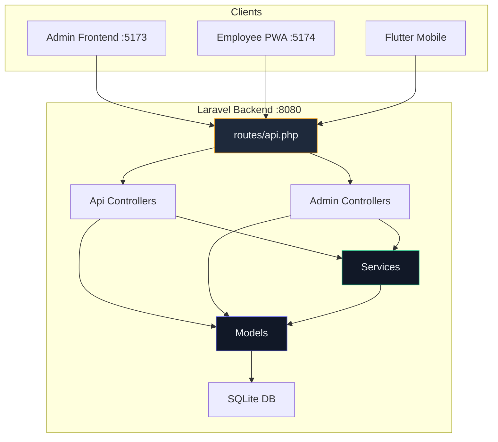

# 📂 Backend Folder Structure — Analysis & Review

> **Project**: Attendance App v4  
> **Stack**: Laravel 13 · PHP 8.3 · Sanctum 4 · SQLite · WebAuthn  
> **Date**: 2026-05-05

---

## 1. Architecture Overview

The backend is a standard **Laravel API** application serving both an **Admin panel** (web frontend) and **Employee PWA/Mobile** clients. It uses **Sanctum** for token-based authentication with a custom refresh-token mechanism, and includes a **WebAuthn** (FIDO2) integration for biometric login.



### API Route Summary

| Prefix | Auth | Role | Controller | Endpoints |
|---|---|---|---|---|
| `/api/auth` | Public | — | `Api\AuthController` | register, login, refresh |
| `/api/webauthn` | Public | — | `Api\WebAuthnController` | register/login options+verify |
| `/api/auth` | Sanctum | — | `Api\AuthController` | logout, user |
| `/api/attendance` | Sanctum | — | `Api\AttendanceController` | clock-in, clock-out, today, history |
| `/api/admin/employees` | Sanctum | Admin | `Admin\EmployeeController` | CRUD (5 endpoints) |
| `/api/admin/attendances` | Sanctum | Admin | `Admin\AttendanceController` | index, update |
| `/api/admin/payroll` | Sanctum | Admin | `Admin\PayrollController` | index, generate |
| `/api/admin/settings` | Sanctum | Admin | `Admin\SettingsController` | show, update |
| `/api/admin/reports` | Sanctum | Admin | `Admin\ReportController` | export, summary |
| `/api/admin/dashboard` | Sanctum | Admin | `Admin\DashboardController` | stats, todayActivity |

**Total**: ~24 API endpoints across 9 controllers.

---

## 2. Full Directory Tree

```
backend/
├── app/
│   ├── Exceptions/
│   │   ├── AttendanceException.php      # Renderable attendance errors
│   │   ├── GeofenceException.php        # Renderable geofence violations
│   │   └── PayrollException.php         # Renderable payroll errors
│   ├── Http/
│   │   ├── Controllers/
│   │   │   ├── Controller.php           # Base controller (empty)
│   │   │   ├── Admin/                   # 6 admin-only controllers
│   │   │   │   ├── AttendanceController.php
│   │   │   │   ├── DashboardController.php
│   │   │   │   ├── EmployeeController.php
│   │   │   │   ├── PayrollController.php
│   │   │   │   ├── ReportController.php
│   │   │   │   └── SettingsController.php
│   │   │   └── Api/                     # 3 API controllers
│   │   │       ├── AttendanceController.php
│   │   │       ├── AuthController.php
│   │   │       └── WebAuthnController.php
│   │   └── Middleware/
│   │       ├── CheckRole.php            # Role-based access control
│   │       ├── Cors.php                 # CORS middleware (UNUSED)
│   │       └── CorsMiddleware.php       # CORS middleware (ACTIVE)
│   ├── Models/                          # 7 Eloquent models
│   │   ├── Attendance.php
│   │   ├── Department.php
│   │   ├── LeaveRequest.php
│   │   ├── OfficeLocation.php
│   │   ├── Payroll.php
│   │   ├── User.php
│   │   └── WebAuthnCredential.php
│   ├── Providers/
│   │   └── AppServiceProvider.php       # Empty provider
│   └── Services/                        # 2 business logic services
│       ├── GeofenceService.php
│       └── PayrollService.php
├── bootstrap/
│   ├── app.php                          # Middleware registration
│   └── providers.php
├── config/                              # 12 config files
│   ├── app.php
│   ├── auth.php
│   ├── cors.php
│   ├── sanctum.php
│   └── ... (8 more standard configs)
├── database/
│   ├── database.sqlite                  # SQLite database file
│   ├── factories/
│   │   └── UserFactory.php
│   ├── migrations/                      # 12 migration files
│   │   ├── 0001_01_01_000000_create_users_table.php
│   │   ├── 0001_01_01_000001_create_cache_table.php
│   │   ├── 0001_01_01_000002_create_jobs_table.php
│   │   ├── 2026_05_02_000001_update_users_table.php
│   │   ├── 2026_05_02_000002_create_departments_table.php
│   │   ├── 2026_05_02_000003_create_office_locations_table.php
│   │   ├── 2026_05_02_000004_create_attendances_table.php
│   │   ├── 2026_05_02_000005_create_leave_requests_table.php
│   │   ├── 2026_05_02_000006_create_payrolls_table.php
│   │   ├── 2026_05_02_000007_create_web_authn_credentials_table.php
│   │   ├── 2026_05_02_000008_add_refresh_token_to_users.php
│   │   └── 2026_05_02_141439_create_personal_access_tokens_table.php
│   └── seeders/
│       ├── DatabaseSeeder.php
│       ├── OfficeLocationSeeder.php
│       └── UserSeeder.php              # 161 lines with attendance gen
├── routes/
│   ├── api.php                          # All API routes (64 lines)
│   ├── console.php
│   └── web.php                          # Welcome view only
├── tests/
│   ├── Feature/ExampleTest.php          # Scaffold only
│   ├── Unit/ExampleTest.php             # Scaffold only
│   └── TestCase.php
├── .env.example
├── composer.json
└── phpunit.xml
```

---

## 3. Pros ✅

### 3.1 Clean Controller Separation

Controllers are properly split by **audience** and **domain**:
- `Api/` — 3 controllers for employee-facing APIs (auth, attendance, WebAuthn)
- `Admin/` — 6 controllers for admin-facing APIs (employees, payroll, reports, etc.)

Each controller is **focused and lean** — the largest is [ReportController.php](file:///c:/Attendance_Apps%20v4/backend/app/Http/Controllers/Admin/ReportController.php) at 156 lines. Most are under 80 lines. This is a stark contrast to the frontend's bloated pages.

| Controller | Lines | Verdict |
|---|---|---|
| Admin/DashboardController | 66 | ✅ Lean |
| Admin/AttendanceController | 70 | ✅ Lean |
| Admin/PayrollController | 73 | ✅ Lean |
| Admin/SettingsController | 77 | ✅ Lean |
| Admin/EmployeeController | 120 | ✅ Good |
| Api/AuthController | 130 | ✅ Good |
| Admin/ReportController | 156 | ✅ Acceptable |
| Api/AttendanceController | 170 | ✅ Acceptable |
| Api/WebAuthnController | 253 | ⚠️ Borderline |

### 3.2 Service Layer Exists

Business logic is correctly extracted into dedicated services:
- [GeofenceService.php](file:///c:/Attendance_Apps%20v4/backend/app/Services/GeofenceService.php) — Haversine distance calculation, office proximity checks
- [PayrollService.php](file:///c:/Attendance_Apps%20v4/backend/app/Services/PayrollService.php) — Monthly payroll calculation with overtime, late deductions

Both are injected via **constructor injection** using PHP 8 `readonly` promoted properties, demonstrating proper DI practices.

### 3.3 Custom Domain Exceptions

Three well-structured renderable exceptions with dedicated error codes:

| Exception | Code | HTTP Status | Error Code |
|---|---|---|---|
| [AttendanceException](file:///c:/Attendance_Apps%20v4/backend/app/Exceptions/AttendanceException.php) | `ATTENDANCE_ERROR` | 422 | ✅ |
| [GeofenceException](file:///c:/Attendance_Apps%20v4/backend/app/Exceptions/GeofenceException.php) | `GEOFENCE_VIOLATION` | 403 | ✅ |
| [PayrollException](file:///c:/Attendance_Apps%20v4/backend/app/Exceptions/PayrollException.php) | `PAYROLL_ERROR` | 422 | ✅ |

GeofenceException is particularly well-designed — it includes `distance` and `allowed_radius` in the response, enabling the frontend to show meaningful error messages (e.g., "You're 245m away, max allowed is 100m").

### 3.4 Well-Designed Database Schema

- **12 migrations** covering all domain entities with proper foreign keys and cascade rules.
- [Attendance migration](file:///c:/Attendance_Apps%20v4/backend/database/migrations/2026_05_02_000004_create_attendances_table.php) includes **composite indexes** on `(user_id, clock_in)` for query performance.
- Coordinates stored as `decimal(10,8)` / `decimal(11,8)` — correct precision for GPS data.
- Enum fields (`status`, `type`) enforce data integrity at the DB level.

### 3.5 Modern PHP/Laravel Features

- Uses **PHP 8.3** with latest **Laravel 13**.
- `#[Fillable]` and `#[Hidden]` **PHP attributes** on models instead of array properties (modern Laravel pattern).
- `readonly` constructor promotion for service injection.
- Arrow functions (`fn()`) throughout.
- Return type declarations on all methods.
- Laravel 13's slim `bootstrap/app.php` configuration.

### 3.6 Robust Auth Implementation

- **Sanctum token authentication** with proper token lifecycle.
- Custom **refresh token** mechanism stored in the users table.
- Token revocation on refresh (deletes old tokens before creating new ones).
- `user()` endpoint eagerly loads department relation.
- **WebAuthn (FIDO2)** support for biometric authentication — an advanced, forward-looking feature.

### 3.7 Comprehensive Seeders

[UserSeeder.php](file:///c:/Attendance_Apps%20v4/backend/database/seeders/UserSeeder.php) is **idempotent** (uses `firstOrCreate`), creates:
- 3 departments
- 1 admin user + 5 employees
- ~30 days of realistic attendance history per employee (with random late/absent patterns)
- Weekend exclusions for realistic data

This makes the app **immediately usable** after `php artisan migrate --seed`.

### 3.8 Pagination with Limits

All list endpoints implement pagination with a **configurable `per_page`** capped via `min()`:
```php
$perPage = min($request->input('per_page', 30), 100);
```
This prevents clients from accidentally requesting enormous datasets — important for SQLite performance.

### 3.9 Geofence Validation

Clock-in uses the GeofenceService to verify employee proximity to the office using the **Haversine formula** with configurable radius. This is production-grade geolocation logic.

---

## 4. Cons ❌

### 4.1 🔴 Duplicate CORS Middleware (Confusing + Bug-Prone)

Two nearly identical CORS middleware files exist:

| File | Status | Lines |
|---|---|---|
| [Cors.php](file:///c:/Attendance_Apps%20v4/backend/app/Http/Middleware/Cors.php) | **UNUSED** (dead code) | 35 |
| [CorsMiddleware.php](file:///c:/Attendance_Apps%20v4/backend/app/Http/Middleware/CorsMiddleware.php) | **ACTIVE** (registered in bootstrap) | 34 |

They differ only in minor details:
- `Cors.php` includes `X-CSRF-TOKEN` in allowed headers and `Access-Control-Allow-Private-Network` — `CorsMiddleware.php` does not.
- The active middleware (`CorsMiddleware`) is missing features from the inactive one.

> [!CAUTION]
> Additionally, Laravel **already ships** with a built-in CORS handler via `config/cors.php` (which IS configured). The custom middleware **duplicates** this functionality, creating three layers of CORS handling. The `config/cors.php` and custom middleware can produce conflicting headers.

### 4.2 🔴 Refresh Token Stored as Plain Text

```php
// AuthController.php
private function generateRefreshToken(User $user): string
{
    $token = Str::random(64);
    $user->update(['refresh_token' => $token]);  // ← PLAIN TEXT
    return $token;
}
```

The refresh token is stored as a **raw, unhashed string** directly in the `users` table. If the database is compromised, all refresh tokens are immediately usable. Sanctum's access tokens are hashed — but the refresh tokens bypass this security.

> [!WARNING]
> This is a **security vulnerability**. Refresh tokens should be hashed (like passwords) or stored in a dedicated table with expiry timestamps.

### 4.3 🔴 No Form Request Validation Classes

All validation is done **inline** in controller methods:
```php
$validated = $request->validate([
    'name' => 'required|string|max:255',
    'email' => 'required|email|unique:users,email',
    ...
]);
```

While functional, this bloats controllers and prevents reuse. Laravel's `FormRequest` classes are the standard approach for separating validation from controller logic.

### 4.4 🔴 No API Resource Classes

All API responses manually construct arrays:
```php
return response()->json([
    'success' => true,
    'data' => $employees->items(),
    'meta' => [
        'current_page' => $employees->currentPage(),
        ...
    ],
]);
```

This ~8 line response pattern is **copy-pasted across every controller method** (appears 15+ times). Laravel's `JsonResource` and `ResourceCollection` classes exist specifically for this purpose.

### 4.5 🟠 No Tests Beyond Scaffolding

The `tests/` directory contains only Laravel's default scaffold:
- `Feature/ExampleTest.php` — Checks if `/` returns 200
- `Unit/ExampleTest.php` — Asserts `true === true`

Zero test coverage for all 9 controllers, 2 services, 3 exceptions, and authentication flow. For a system handling payroll calculations and attendance tracking, this is a significant gap.

### 4.6 🟠 SQLite in Production

The `.env.example` defaults to SQLite (`DB_CONNECTION=sqlite`) and a physical `database/database.sqlite` file is committed. While acceptable for development:

> [!WARNING]
> SQLite has **no concurrent write support**, no built-in user authentication, and limited scalability. For a multi-user attendance system with real-time clock-in/out, this will become a bottleneck once 10+ users are active simultaneously.

### 4.7 🟠 Settings Update Creates New Records

[SettingsController::update](file:///c:/Attendance_Apps%20v4/backend/app/Http/Controllers/Admin/SettingsController.php#L31-L76) deactivates all offices and **creates a new one** on every settings save:
```php
OfficeLocation::where('is_active', true)->update(['is_active' => false]);
$office = OfficeLocation::create([...]);
```

This means the `office_locations` table grows unboundedly with each settings change, and historical attendance records now reference deactivated locations (which works but is wasteful).

### 4.8 🟠 Config::set Is Not Persistent

```php
// SettingsController.php line 61
config(['app.name' => $validated['company_name']]);
```

`config()` only sets values for the **current request**. After the response, the company name reverts to the `.env` value. This gives the admin a false sense that the setting was saved.

### 4.9 🟠 Fillable Attribute Potentially Broken

Several models use `#[Fillable(...)]` as a PHP attribute:
```php
#[Fillable(['user_id', 'office_location_id', ...])]
class Attendance extends Model
```

But the `Attendance` model is **missing the `use` import** for the `Fillable` attribute from `Illuminate\Database\Eloquent\Attributes\Fillable`. Only the `User` model properly imports it. If these models work, it's likely because `$guarded = []` is set globally somewhere or the attribute is silently ignored.

### 4.10 🟠 WebAuthn Uses Session for Stateless API

The [WebAuthnController](file:///c:/Attendance_Apps%20v4/backend/app/Http/Controllers/Api/WebAuthnController.php) stores challenges in `$request->session()`:
```php
$request->session()->put('webauthn_challenge', $publicKeyOptions->challenge);
```

But API routes typically don't have session middleware. This may silently fail or require the `web` middleware group to be mixed into API routes, creating session/CSRF complications.

### 4.11 🟡 Missing `LeaveRequest` Controller

The `LeaveRequest` model exists with full migration, but there are **no controllers or routes** for leave management. The frontend `types/auth.ts` defines the interface, suggesting this feature was planned but never implemented.

### 4.12 🟡 Duplicate Seeder Logic

Both [UserSeeder](file:///c:/Attendance_Apps%20v4/backend/database/seeders/UserSeeder.php) and [OfficeLocationSeeder](file:///c:/Attendance_Apps%20v4/backend/database/seeders/OfficeLocationSeeder.php) create office locations independently with different data:

| Seeder | Office Name | Start Time | Coordinates |
|---|---|---|---|
| UserSeeder | "Headquarters" | 08:00 | -6.208764, 106.845599 |
| OfficeLocationSeeder | "Head Office" | 09:00 | -6.2088, 106.8456 |

Both run via `DatabaseSeeder`, potentially creating duplicate/conflicting office records.

### 4.13 🟡 No Rate Limiting on Auth Endpoints

Login and register endpoints have no rate limiting. An attacker can brute-force credentials indefinitely. Laravel provides `throttle:` middleware out of the box.

### 4.14 🟡 Late Detection Logic Is Fragile

```php
// Api/AttendanceController.php line 64
$isLate = $now->diffInMinutes($startTime) > 30;
```

`diffInMinutes` returns an **absolute value** — it doesn't check if `$now` is after `$startTime`. Someone clocking in at 7:00 AM (before the 9:00 start) would get `diffInMinutes = 120 > 30 = true` → incorrectly flagged as **late**.

### 4.15 🟡 Unused `Validator` Import

[EmployeeController.php](file:///c:/Attendance_Apps%20v4/backend/app/Http/Controllers/Admin/EmployeeController.php) imports `Illuminate\Support\Facades\Validator` but never uses it (all validation uses `$request->validate()`).

---

## 5. Scoring Summary

| Category | Score | Notes |
|---|---|---|
| **Folder Organization** | ⭐⭐⭐⭐⭐ | Clean Admin/Api split, proper Laravel conventions. |
| **Controller Design** | ⭐⭐⭐⭐ | Lean and focused, but missing FormRequests + Resources. |
| **Service Layer** | ⭐⭐⭐⭐ | Exists for complex logic (geofence, payroll). Could expand. |
| **Database Design** | ⭐⭐⭐⭐ | Good schema, proper indexes, FK constraints. |
| **Authentication** | ⭐⭐⭐ | Sanctum + WebAuthn, but plain-text refresh tokens. |
| **Error Handling** | ⭐⭐⭐⭐ | Custom renderable exceptions with error codes. |
| **Testing** | ⭐ | No real tests. Only scaffolding defaults. |
| **Security** | ⭐⭐ | Plain-text refresh tokens, no rate limiting, CORS confusion. |
| **Code Quality** | ⭐⭐⭐⭐ | Modern PHP 8.3 features, consistent style, typed returns. |
| **Overall** | **⭐⭐⭐½ (3.5/5)** | Strong architecture, but critical security and testing gaps. |

---

## 6. Improvement Roadmap

### 🔴 Priority 1 — Fix Refresh Token Security

Hash refresh tokens before storing them, and add an expiry column:

```php
// Migration
Schema::table('users', function (Blueprint $table) {
    $table->renameColumn('refresh_token', 'refresh_token_hash');
    $table->timestamp('refresh_token_expires_at')->nullable();
});

// AuthController
private function generateRefreshToken(User $user): string
{
    $plainToken = Str::random(64);
    $user->update([
        'refresh_token_hash' => hash('sha256', $plainToken),
        'refresh_token_expires_at' => now()->addDays(30),
    ]);
    return $plainToken;
}
```

### 🔴 Priority 2 — Delete Duplicate CORS Middleware

1. Delete `app/Http/Middleware/Cors.php` (dead code).
2. Delete `app/Http/Middleware/CorsMiddleware.php`.
3. Remove the `'cors'` alias from `bootstrap/app.php`.
4. Rely solely on Laravel's built-in CORS handler via `config/cors.php`.
5. Update `routes/api.php` to remove `->middleware('cors')`.

### 🔴 Priority 3 — Add Form Request Classes

Create dedicated FormRequest classes:

```
app/Http/Requests/
├── Auth/
│   ├── LoginRequest.php
│   └── RegisterRequest.php
├── Attendance/
│   ├── ClockInRequest.php
│   └── ClockOutRequest.php
├── Admin/
│   ├── StoreEmployeeRequest.php
│   ├── UpdateEmployeeRequest.php
│   ├── GeneratePayrollRequest.php
│   └── UpdateSettingsRequest.php
```

### 🔴 Priority 4 — Add API Resource Classes

Create reusable response transformers:

```
app/Http/Resources/
├── UserResource.php
├── AttendanceResource.php
├── AttendanceCollection.php
├── PayrollResource.php
└── PaginatedCollection.php
```

This eliminates the 15+ copy-pasted response builders across controllers.

### 🟠 Priority 5 — Write Tests

```
tests/
├── Feature/
│   ├── Auth/
│   │   ├── LoginTest.php
│   │   ├── RegisterTest.php
│   │   └── RefreshTokenTest.php
│   ├── Attendance/
│   │   ├── ClockInTest.php
│   │   ├── ClockOutTest.php
│   │   └── HistoryTest.php
│   └── Admin/
│       ├── EmployeeCrudTest.php
│       └── PayrollGenerationTest.php
└── Unit/
    ├── GeofenceServiceTest.php
    └── PayrollServiceTest.php
```

Critical tests to write first:
- `GeofenceServiceTest` — Verify Haversine calculation with known coordinates
- `ClockInTest` — Verify geofence rejection, duplicate clock-in prevention, late detection
- `PayrollServiceTest` — Verify salary calculation, overtime, late deductions

### 🟠 Priority 6 — Add Rate Limiting

```php
// bootstrap/app.php
$middleware->api(prepend: [
    \Illuminate\Routing\Middleware\ThrottleRequests::class.':60,1',
]);

// routes/api.php — Tighter limit on auth routes
Route::prefix('auth')
    ->middleware('throttle:5,1')  // 5 attempts per minute
    ->group(function () { ... });
```

### 🟠 Priority 7 — Fix Late Detection Bug

```php
// Before (buggy — absolute diff)
$isLate = $now->diffInMinutes($startTime) > 30;

// After (correct — check if after start + grace period)
$graceEnd = $startTime->copy()->addMinutes(30);
$isLate = $now->greaterThan($graceEnd);
```

### 🟡 Priority 8 — Fix Settings Controller

Replace `create` with `updateOrCreate` and remove the `config()` call:

```php
$office = OfficeLocation::updateOrCreate(
    ['is_active' => true],
    [
        'name' => $validated['office_name'] ?? 'Head Office',
        'latitude' => $validated['latitude'],
        // ...
    ]
);
// Remove: config(['app.name' => ...])  — not persistent
```

### 🟡 Priority 9 — Implement Leave Request Feature

The model and migration exist. Add:
- `Api/LeaveRequestController.php` — `store`, `index`, `show`, `cancel`
- `Admin/LeaveRequestController.php` — `index`, `approve`, `reject`
- Routes in `api.php`

### 🟡 Priority 10 — Fix Model Fillable Imports

Add the missing import to all models that use the `#[Fillable]` attribute:

```php
use Illuminate\Database\Eloquent\Attributes\Fillable;
```

Currently only `User.php` imports it. `Attendance`, `Payroll`, `OfficeLocation`, `LeaveRequest`, `Department`, and `WebAuthnCredential` are all missing the import.

---

## 7. Backend vs Frontend Comparison

| Aspect | Backend | Frontend |
|---|---|---|
| **Folder Organization** | ⭐⭐⭐⭐⭐ | ⭐⭐⭐⭐ |
| **Code Size per File** | ✅ All under 260 lines | ❌ 9 pages over 500 lines |
| **Separation of Concerns** | ✅ Controller → Service → Model | ❌ Logic embedded in pages |
| **Dead Code** | 🟡 1 unused CORS file | 🔴 8 scaffold files + 3 dead entries |
| **Test Coverage** | ❌ None | ❌ None |
| **Type Safety** | ✅ PHP 8.3 strict types + casts | ✅ TypeScript + interfaces |
| **Overall** | ⭐⭐⭐½ | ⭐⭐⭐ |

---

## 8. Conclusion

The backend has a **stronger architecture than the frontend** — controllers are lean, services properly extract business logic, and the database schema is well-designed with appropriate indexes. The codebase leverages modern PHP 8.3 and Laravel 13 features effectively.

However, **security is the biggest concern**: plain-text refresh tokens, no rate limiting, and CORS confusion create real vulnerabilities. The complete absence of tests is also a significant risk for a payroll system where calculation errors have real financial consequences. The most impactful improvements would be fixing the refresh token security, removing CORS duplication, and adding test coverage for the GeofenceService and PayrollService.
