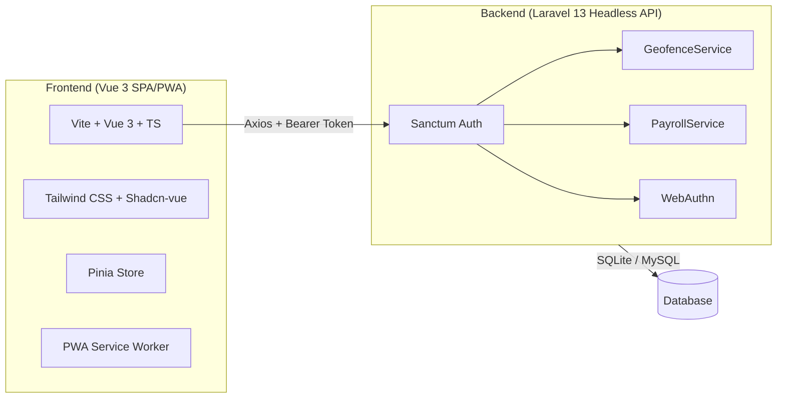

# 📋 Deployment Guide — Attendance App v4

## Ringkasan Arsitektur Proyek



| Layer | Tech Stack | Versi |
|-------|-----------|-------|
| **Backend** | Laravel (Headless API) | 13.x (PHP 8.3+) |
| **Auth** | Laravel Sanctum (Token-based) | 4.3 |
| **Biometrics** | WebAuthn (`web-auth/webauthn-lib`) | 5.3 |
| **Frontend** | Vue 3 + TypeScript + Vite | Vue 3.5, Vite 8, TS 6 |
| **UI** | Tailwind CSS 4 + Shadcn-vue | 4.2 / 2.6 |
| **State** | Pinia | 3.0 |
| **PWA** | vite-plugin-pwa (Workbox) | 1.2 |
| **Database** | SQLite (dev) → MySQL/PostgreSQL (prod) | - |
| **Maps** | Leaflet.js | 1.9 |

### Struktur Halaman

| Portal | Halaman |
|--------|---------|
| **Employee** | Login, Dashboard, Clock In/Out, History, Profile, Settings |
| **Admin** | Login, Dashboard, Employees CRUD, Attendance, Payroll, Reports, Settings |

---

## Opsi Hosting yang Direkomendasikan

### Opsi A: VPS (Paling Fleksibel & Murah) ⭐

| Provider | Spek Minimum | Harga/bulan |
|----------|-------------|-------------|
| DigitalOcean | 1 vCPU, 1GB RAM, 25GB SSD | ~$6 |
| Hetzner | 2 vCPU, 2GB RAM, 20GB SSD | ~€4 |
| Vultr | 1 vCPU, 1GB RAM, 25GB SSD | ~$6 |

> [!TIP]
> VPS adalah opsi paling cost-effective. Backend + Frontend bisa di-host dalam 1 server yang sama.

### Opsi B: PaaS (Managed)

| Service | Backend | Frontend | Database |
|---------|---------|----------|----------|
| Railway | ✅ Laravel | ✅ Static | ✅ MySQL |
| Render | ✅ Laravel | ✅ Static | ✅ PostgreSQL |
| Vercel + PlanetScale | ❌ | ✅ Vue SPA | ✅ MySQL |

### Opsi C: Shared Hosting (Budget)

Hosting seperti Niagahoster, Hostinger, atau cPanel-based hosting bisa digunakan untuk Laravel + serve file statis frontend.

> [!WARNING]
> Shared hosting biasanya **tidak mendukung** PHP 8.3+ dan queue workers. Pastikan provider mendukung versi PHP yang dibutuhkan.

---

## Tahap 1: Persiapan Database Produksi

Proyek saat ini menggunakan **SQLite** (development). Untuk production, migrasi ke **MySQL** atau **PostgreSQL**.

### Konfigurasi `.env` Production (Backend)

```env
# === APP ===
APP_NAME=AttendanceApp
APP_ENV=production
APP_KEY=base64:GENERATE_NEW_KEY
APP_DEBUG=false
APP_URL=https://api.yourdomain.com

FRONTEND_URL=https://app.yourdomain.com

# === DATABASE (MySQL) ===
DB_CONNECTION=mysql
DB_HOST=127.0.0.1
DB_PORT=3306
DB_DATABASE=attendance_db
DB_USERNAME=attendance_user
DB_PASSWORD=STRONG_PASSWORD_HERE

# === SESSION ===
SESSION_DRIVER=database
SESSION_LIFETIME=120
SESSION_DOMAIN=.yourdomain.com
SESSION_SECURE_COOKIE=true

# === SANCTUM ===
SANCTUM_STATEFUL_DOMAINS=app.yourdomain.com,api.yourdomain.com

# === QUEUE ===
QUEUE_CONNECTION=database

# === CACHE ===
CACHE_STORE=database

# === CORS ===
# Otomatis dari FRONTEND_URL di config/cors.php
```

> [!CAUTION]
> **JANGAN** gunakan `APP_KEY` yang sama dari development. Generate key baru dengan `php artisan key:generate`.

---

## Tahap 2: Deploy Backend (Laravel)

### 2.1 — Setup Server (VPS)

```bash
# Update system
sudo apt update && sudo apt upgrade -y

# Install PHP 8.3+ dan ekstensi yang dibutuhkan
sudo apt install -y php8.3-fpm php8.3-cli php8.3-mbstring php8.3-xml \
  php8.3-curl php8.3-zip php8.3-mysql php8.3-sqlite3 php8.3-gd \
  php8.3-bcmath php8.3-intl unzip git

# Install Composer
curl -sS https://getcomposer.org/installer | php
sudo mv composer.phar /usr/local/bin/composer

# Install Nginx
sudo apt install -y nginx

# Install MySQL
sudo apt install -y mysql-server
sudo mysql_secure_installation
```

### 2.2 — Setup Database

```sql
-- Login ke MySQL
CREATE DATABASE attendance_db CHARACTER SET utf8mb4 COLLATE utf8mb4_unicode_ci;
CREATE USER 'attendance_user'@'localhost' IDENTIFIED BY 'STRONG_PASSWORD';
GRANT ALL PRIVILEGES ON attendance_db.* TO 'attendance_user'@'localhost';
FLUSH PRIVILEGES;
```

### 2.3 — Deploy Kode Backend

```bash
# Clone/upload project ke server
cd /var/www
git clone YOUR_REPO_URL attendance-app
cd attendance-app/backend

# Install dependencies (tanpa dev)
composer install --no-dev --optimize-autoloader

# Setup environment
cp .env.example .env
nano .env  # Edit sesuai konfigurasi production di atas

# Generate key & migrate
php artisan key:generate
php artisan migrate --force
php artisan config:cache
php artisan route:cache
php artisan view:cache

# Set permissions
sudo chown -R www-data:www-data storage bootstrap/cache
sudo chmod -R 775 storage bootstrap/cache
```

### 2.4 — Nginx Config (Backend API)

```nginx
server {
    listen 80;
    server_name api.yourdomain.com;
    root /var/www/attendance-app/backend/public;
    index index.php;

    add_header X-Frame-Options "SAMEORIGIN";
    add_header X-Content-Type-Options "nosniff";

    charset utf-8;

    location / {
        try_files $uri $uri/ /index.php?$query_string;
    }

    location = /favicon.ico { access_log off; log_not_found off; }
    location = /robots.txt  { access_log off; log_not_found off; }

    error_page 404 /index.php;

    location ~ \.php$ {
        fastcgi_pass unix:/var/run/php/php8.3-fpm.sock;
        fastcgi_param SCRIPT_FILENAME $realpath_root$fastcgi_script_name;
        include fastcgi_params;
        fastcgi_hide_header X-Powered-By;
    }

    location ~ /\.(?!well-known).* {
        deny all;
    }
}
```

### 2.5 — Setup Queue Worker (Systemd)

```ini
# /etc/systemd/system/attendance-queue.service
[Unit]
Description=Attendance App Queue Worker
After=network.target

[Service]
User=www-data
Group=www-data
Restart=always
ExecStart=/usr/bin/php /var/www/attendance-app/backend/artisan queue:work --sleep=3 --tries=3 --max-time=3600

[Install]
WantedBy=multi-user.target
```

```bash
sudo systemctl enable attendance-queue
sudo systemctl start attendance-queue
```

---

## Tahap 3: Deploy Frontend (Vue 3 PWA)

### 3.1 — Build Production

```bash
cd /path/to/attendance-app/frontend

# Buat file .env.production
echo "VITE_API_URL=https://api.yourdomain.com/api" > .env.production

# Install & build
npm ci
npm run build
```

> [!IMPORTANT]
> Output build ada di folder `dist/`. Folder ini berisi file statis (HTML, JS, CSS) + Service Worker untuk PWA.

### 3.2 — Nginx Config (Frontend SPA)

```nginx
server {
    listen 80;
    server_name app.yourdomain.com;
    root /var/www/attendance-app/frontend/dist;
    index index.html;

    # Gzip compression
    gzip on;
    gzip_types text/plain text/css application/json application/javascript text/xml;
    gzip_min_length 256;

    # Cache static assets
    location ~* \.(js|css|png|jpg|jpeg|gif|ico|svg|woff2?)$ {
        expires 1y;
        add_header Cache-Control "public, immutable";
    }

    # PWA Service Worker - no cache
    location = /sw.js {
        add_header Cache-Control "no-cache, no-store, must-revalidate";
    }

    location = /manifest.webmanifest {
        add_header Cache-Control "no-cache";
        types { application/manifest+json webmanifest; }
    }

    # SPA fallback - semua route ke index.html
    location / {
        try_files $uri $uri/ /index.html;
    }
}
```

### 3.3 — Alternatif: Deploy ke CDN/Static Host

| Platform | Command | Gratis? |
|----------|---------|---------|
| **Vercel** | `npx vercel --prod` | ✅ |
| **Netlify** | `npx netlify deploy --prod --dir=dist` | ✅ |
| **Cloudflare Pages** | Connect repo → auto build | ✅ |

> [!TIP]
> Jika menggunakan Vercel/Netlify, tambahkan rewrite rule untuk SPA:
> ```json
> // vercel.json
> { "rewrites": [{ "source": "/(.*)", "destination": "/index.html" }] }
> ```

---

## Tahap 4: SSL/HTTPS

```bash
# Install Certbot
sudo apt install -y certbot python3-certbot-nginx

# Generate SSL untuk kedua domain
sudo certbot --nginx -d api.yourdomain.com -d app.yourdomain.com

# Auto-renewal
sudo certbot renew --dry-run
```

> [!CAUTION]
> **HTTPS wajib** untuk production karena:
> - PWA membutuhkan HTTPS untuk Service Worker
> - WebAuthn **tidak bekerja** tanpa HTTPS
> - Geolocation API membutuhkan secure context

---

## Tahap 5: Production Checklist

### Backend Security

- [ ] `APP_DEBUG=false`
- [ ] `APP_ENV=production`
- [ ] Generate `APP_KEY` baru
- [ ] `SANCTUM_STATEFUL_DOMAINS` sesuai domain production
- [ ] `FRONTEND_URL` mengarah ke domain frontend production
- [ ] CORS `allowed_origins` hanya izinkan domain frontend
- [ ] Session cookie `secure=true` dan `same_site=lax`
- [ ] Jalankan `php artisan config:cache`
- [ ] Jalankan `php artisan route:cache`

### Frontend

- [ ] `VITE_API_URL` mengarah ke API production
- [ ] Build sukses tanpa TypeScript error (`npm run build`)
- [ ] PWA manifest icons tersedia (`pwa-192x192.png`, `pwa-512x512.png`)
- [ ] Service Worker teregister dengan benar
- [ ] Favicon tersedia

### Infrastructure

- [ ] HTTPS aktif (SSL certificate)
- [ ] Nginx config sudah tested
- [ ] Queue worker berjalan (systemd)
- [ ] Database sudah di-migrate
- [ ] Backup strategy untuk database
- [ ] Monitoring (uptime + error logging)

### PWA Specific

- [ ] `start_url` di manifest sesuai route production
- [ ] `theme_color` dan `background_color` sudah benar
- [ ] Icons PWA 192x192 dan 512x512 tersedia di `/public`
- [ ] Test install PWA di mobile Chrome

---

## Quick Deploy Commands (Ringkasan)

```bash
# === BACKEND ===
cd backend
composer install --no-dev --optimize-autoloader
cp .env.example .env && nano .env
php artisan key:generate
php artisan migrate --force
php artisan config:cache && php artisan route:cache && php artisan view:cache
sudo chown -R www-data:www-data storage bootstrap/cache

# === FRONTEND ===
cd frontend
echo "VITE_API_URL=https://api.yourdomain.com/api" > .env.production
npm ci && npm run build
# Upload dist/ ke server atau deploy ke Vercel/Netlify

# === SSL ===
sudo certbot --nginx -d api.yourdomain.com -d app.yourdomain.com
```

---

## Catatan Penting

> [!WARNING]
> ### Migrasi dari SQLite ke MySQL
> Saat ini database menggunakan SQLite (`database/database.sqlite`). Data development **tidak** otomatis pindah ke MySQL production. Jika ada data seeder yang perlu dimuat:
> ```bash
> php artisan db:seed --force
> ```

> [!NOTE]
> ### Domain Strategy
> Rekomendasi menggunakan subdomain:
> - `api.yourdomain.com` → Backend Laravel API
> - `app.yourdomain.com` → Frontend Vue PWA
>
> Ini menghindari masalah CORS yang kompleks dan memisahkan concern deployment.
