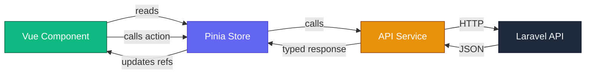

# 📐 Frontend Standards & Patterns Guide

> **Project**: Attendance App v4 — Vue 3 + TypeScript + Tailwind + Shadcn-vue + Pinia  
> **Audience**: Senior-level development reference  
> **Date**: 2026-05-05

---

## 1. Target Directory Structure

```
frontend/src/
├── api/
│   ├── axios.ts                    # Axios instance + interceptors
│   ├── auth.service.ts             # login, register, logout, refresh
│   ├── attendance.service.ts       # clockIn, clockOut, today, history
│   ├── employees.service.ts        # CRUD operations
│   ├── payroll.service.ts          # generate, list
│   ├── reports.service.ts          # export, summary
│   ├── settings.service.ts         # show, update
│   └── dashboard.service.ts        # stats, todayActivity
├── assets/
│   ├── base.css                    # Design tokens (single source of truth)
│   └── main.css                    # Tailwind + Shadcn integration
├── components/
│   ├── shared/                     # Cross-app reusable components
│   │   ├── app-badge.vue
│   │   ├── app-card.vue
│   │   ├── app-empty-state.vue
│   │   ├── app-pagination.vue
│   │   ├── data-table.vue
│   │   └── status-badge.vue
│   ├── admin/                      # Admin-only composed components
│   │   ├── admin-sidebar.vue
│   │   ├── admin-stat-card.vue
│   │   ├── employee-form.vue
│   │   └── payroll-table.vue
│   ├── employee/                   # Employee-only composed components
│   │   ├── employee-tab-bar.vue
│   │   ├── clock-button.vue
│   │   ├── attendance-card.vue
│   │   └── employee-skeleton.vue
│   └── ui/                         # Shadcn-vue primitives (auto-generated)
│       ├── button/
│       ├── card/
│       └── ...
├── composables/
│   ├── use-geolocation.ts
│   ├── use-notifications.ts
│   ├── use-theme.ts
│   ├── use-web-authn.ts
│   └── use-pagination.ts
├── layouts/
│   ├── admin-layout.vue
│   └── employee-layout.vue
├── lib/
│   ├── utils.ts                    # cn() helper
│   └── formatters.ts               # Date, time, currency formatters
├── pages/
│   ├── admin/
│   │   ├── dashboard-page.vue      # Orchestrator only (< 200 lines)
│   │   ├── employees-page.vue
│   │   ├── attendance-page.vue
│   │   ├── payroll-page.vue
│   │   ├── reports-page.vue
│   │   ├── settings-page.vue
│   │   └── admin-login-page.vue
│   └── employee/
│       ├── dashboard-page.vue
│       ├── clock-page.vue
│       ├── history-page.vue
│       ├── profile-page.vue
│       ├── settings-page.vue
│       └── employee-login-page.vue
├── router/
│   ├── admin.ts
│   └── employee.ts
├── store/
│   ├── auth.ts                     # Auth state + token management
│   ├── attendance.ts               # Today's status, clock state
│   ├── employees.ts                # Employee list + filters
│   ├── payroll.ts                  # Payroll data
│   └── ui.ts                       # Sidebar, modals, toasts
└── types/
    ├── auth.ts                     # User, LoginCredentials
    ├── attendance.ts               # Attendance, ClockInRequest
    ├── payroll.ts                  # Payroll
    ├── leave.ts                    # LeaveRequest
    ├── settings.ts                 # OfficeLocation, GeofenceLocation
    └── api.ts                      # ApiResponse<T>, PaginatedResponse<T>
```

---

## 2. Naming Conventions

### Files

| Type | Convention | Example |
|---|---|---|
| Components | `kebab-case.vue` | `admin-sidebar.vue` |
| Composables | `use-kebab-case.ts` | `use-geolocation.ts` |
| Stores | `kebab-case.ts` (noun) | `attendance.ts` |
| Services | `kebab-case.service.ts` | `attendance.service.ts` |
| Types | `kebab-case.ts` (domain noun) | `attendance.ts` |
| Pages | `kebab-case-page.vue` | `dashboard-page.vue` |
| Layouts | `kebab-case-layout.vue` | `admin-layout.vue` |

### Code

```typescript
// ✅ Interfaces — PascalCase, prefixed with domain
interface User { ... }
interface Attendance { ... }
interface ClockInRequest { ... }
interface ApiResponse<T> { ... }

// ✅ Composables — camelCase, prefixed with "use"
export function useGeolocation() { ... }
export function useTheme() { ... }

// ✅ Stores — camelCase, prefixed with "use...Store"
export const useAuthStore = defineStore('auth', () => { ... })
export const useAttendanceStore = defineStore('attendance', () => { ... })

// ✅ Services — named exports, verb-first
export async function fetchDashboardStats(): Promise<DashboardStats> { ... }
export async function clockIn(data: ClockInRequest): Promise<Attendance> { ... }

// ✅ Refs — always explicitly typed
const user = ref<User | null>(null)
const isLoading = ref<boolean>(false)
const employees = ref<User[]>([])

// ✅ Route names — kebab-case with domain prefix
{ name: 'admin-dashboard', path: '' }
{ name: 'employee-clock', path: 'clock' }
```

---

## 3. Component Architecture

### The 200-Line Rule

> Every `.vue` file MUST stay under **200 lines** of `<script>` code. If it exceeds this, decompose.

### Component Hierarchy

```
Page (orchestrator)          → max 200 lines script
  └── Section components     → max 150 lines script
       └── UI primitives     → Shadcn or shared components
```

### Page Component Pattern

Pages are **thin orchestrators** — they import child components, call stores, and compose layout. No business logic, no inline API calls, no complex computed.

```vue
<!-- ✅ CORRECT: pages/admin/dashboard-page.vue -->
<script setup lang="ts">
import { onMounted } from 'vue'
import { useDashboardStore } from '@/store/dashboard'
import DashboardStats from '@/components/admin/dashboard-stats.vue'
import ActivityFeed from '@/components/admin/activity-feed.vue'
import EmployeePreview from '@/components/admin/employee-preview.vue'

const dashboard = useDashboardStore()

onMounted(() => {
  dashboard.initialize()
})
</script>

<template>
  <div class="space-y-6">
    <DashboardStats :stats="dashboard.stats" :loading="dashboard.isLoading" />
    <div class="grid grid-cols-1 lg:grid-cols-2 gap-6">
      <ActivityFeed
        :records="dashboard.todayActivity"
        :loading="dashboard.activityLoading"
      />
      <EmployeePreview
        :employees="dashboard.employees"
        :loading="dashboard.isLoading"
      />
    </div>
  </div>
</template>
```

```vue
<!-- ❌ WRONG: Everything in one 700-line page -->
<script setup lang="ts">
import apiClient from '@/api/axios'
// ... 50 lines of imports
// ... 30 lines of refs
// ... 200 lines of fetch functions
// ... 80 lines of helpers
// ... 340 lines of template
</script>
```

### Section Component Pattern

Section components own a **focused slice of UI** — one card, one table, one form section.

```vue
<!-- ✅ components/admin/dashboard-stats.vue -->
<script setup lang="ts">
import { CheckCircle, Clock, XCircle, Timer } from 'lucide-vue-next'
import { Card, CardContent, CardHeader, CardTitle } from '@/components/ui/card'
import { Skeleton } from '@/components/ui/skeleton'
import { formatHours } from '@/lib/formatters'

interface Props {
  stats: {
    present_today: number
    late_today: number
    absent_today: number
    total_hours_today: number
  }
  loading: boolean
}

defineProps<Props>()

const cards = [
  { key: 'present_today', label: 'Present', icon: CheckCircle, color: 'green' },
  { key: 'late_today', label: 'Late', icon: Clock, color: 'yellow' },
  { key: 'absent_today', label: 'Absent', icon: XCircle, color: 'red' },
  { key: 'total_hours_today', label: 'Hours', icon: Timer, color: 'emerald' },
] as const
</script>
```

### Shared Component Pattern

Shared components use `interface Props` with `defineProps` and emit typed events:

```vue
<!-- ✅ components/shared/app-pagination.vue -->
<script setup lang="ts">
interface Props {
  currentPage: number
  lastPage: number
  loading?: boolean
}

interface Emits {
  (e: 'page-change', page: number): void
}

defineProps<Props>()
const emit = defineEmits<Emits>()
</script>
```

---

## 4. API Service Layer

### Pattern: One Service per Backend Resource

Each service file wraps `apiClient` calls for a single domain. Services handle request/response typing — stores and components never call `apiClient` directly.

```typescript
// ✅ api/attendance.service.ts
import apiClient from './axios'
import type { Attendance, ClockInRequest, ClockOutRequest } from '@/types/attendance'
import type { ApiResponse, PaginatedResponse } from '@/types/api'

export async function clockIn(data: ClockInRequest): Promise<ApiResponse<{
  attendance: Attendance
  distance: number
  is_late: boolean
}>> {
  const response = await apiClient.post('/attendance/clock-in', data)
  return response.data
}

export async function clockOut(data: ClockOutRequest): Promise<ApiResponse<{
  attendance: Attendance
  total_hours: number
}>> {
  const response = await apiClient.post('/attendance/clock-out', data)
  return response.data
}

export async function fetchToday(): Promise<ApiResponse<Attendance | null>> {
  const response = await apiClient.get('/attendance/today')
  return response.data
}

export async function fetchHistory(params: {
  page?: number
  per_page?: number
}): Promise<PaginatedResponse<Attendance>> {
  const response = await apiClient.get('/attendance/history', { params })
  return response.data
}
```

```typescript
// ❌ WRONG: Calling apiClient directly in a component
const res = await apiClient.get('/admin/employees', { params: { per_page: 10 } })
employees.value = res.data.data
```

---

## 5. Pinia Store Pattern

### Pattern: Setup Stores with Explicit Typing

Use the **Composition API** (`setup`) syntax for all stores. Each store owns state for one domain and delegates API calls to the service layer.

```typescript
// ✅ store/attendance.ts
import { defineStore } from 'pinia'
import { ref, computed } from 'vue'
import type { Attendance } from '@/types/attendance'
import * as attendanceService from '@/api/attendance.service'

export const useAttendanceStore = defineStore('attendance', () => {
  // ── State ──────────────────────────────────────────
  const todayRecord = ref<Attendance | null>(null)
  const history = ref<Attendance[]>([])
  const isLoading = ref<boolean>(false)
  const error = ref<string | null>(null)
  const currentPage = ref<number>(1)
  const lastPage = ref<number>(1)

  // ── Computed ───────────────────────────────────────
  const isClockedIn = computed(() =>
    todayRecord.value !== null && todayRecord.value.clock_out === null
  )

  // ── Actions ────────────────────────────────────────
  async function fetchToday(): Promise<void> {
    isLoading.value = true
    error.value = null
    try {
      const res = await attendanceService.fetchToday()
      todayRecord.value = res.data
    } catch (e: unknown) {
      error.value = (e as Error).message || 'Failed to fetch'
    } finally {
      isLoading.value = false
    }
  }

  async function clockIn(lat: number, lng: number): Promise<boolean> {
    error.value = null
    try {
      const res = await attendanceService.clockIn({
        latitude: lat, longitude: lng,
        device_id: navigator.userAgent.slice(0, 50),
        biometric_verified: false,
      })
      todayRecord.value = res.data.attendance
      return true
    } catch (e: unknown) {
      const err = e as { response?: { data?: { message?: string } } }
      error.value = err.response?.data?.message || 'Clock-in failed'
      return false
    }
  }

  function $reset(): void {
    todayRecord.value = null
    history.value = []
    isLoading.value = false
    error.value = null
  }

  return {
    todayRecord, history, isLoading, error,
    currentPage, lastPage, isClockedIn,
    fetchToday, clockIn, $reset,
  }
})
```

### Store Rules

| Rule | Rationale |
|---|---|
| Always type `ref<T>()` explicitly | Prevents implicit `any` |
| Use `try/catch` with error ref | Makes errors visible in UI |
| Expose `$reset()` for cleanup | Needed on logout |
| Import services, never `apiClient` | Maintains layer separation |
| Keep stores under 120 lines | Split if needed |

---

## 6. Type System

### Pattern: One File per Domain, Shared Generics in `api.ts`

```typescript
// ✅ types/api.ts — shared response wrappers
export interface ApiResponse<T> {
  success: boolean
  message: string
  data: T
}

export interface PaginatedResponse<T> {
  success: boolean
  data: T[]
  meta: {
    current_page: number
    last_page: number
    per_page: number
    total: number
  }
}
```

```typescript
// ✅ types/attendance.ts — domain models
export interface Attendance {
  id: number
  user_id: number
  clock_in: string
  clock_out: string | null
  status: 'present' | 'late' | 'absent' | 'half_day'
  total_hours: number | null
  notes: string | null
  created_at: string
}

export interface ClockInRequest {
  latitude: number
  longitude: number
  device_id: string
  biometric_verified: boolean
}
```

### Type Rules

| Rule | Example |
|---|---|
| Use `string` unions over `enum` | `status: 'present' \| 'late'` |
| Mark nullable with `\| null` | `clock_out: string \| null` |
| API timestamps are `string` | Parse in formatters, not in types |
| Use `interface` over `type` | Better error messages, extendable |

---

## 7. Error Handling — Three-Layer Strategy

```
API Service  → throws raw AxiosError (no catching)
Pinia Store  → catches, sets error ref, returns success boolean
Component    → reads error ref, renders UI feedback
```

```vue
<!-- ✅ Component renders error from store -->
<template>
  <div v-if="store.error"
    class="rounded-lg bg-destructive/10 p-4 text-sm text-destructive">
    {{ store.error }}
  </div>
</template>
```

---

## 8. Composable Rules

1. Name starts with `use` — `useGeolocation`, `useTheme`
2. Returns plain object of refs + functions
3. Self-contained: manages own localStorage, timers, listeners
4. Cleans up side effects
5. Never calls API services — that's the store's job

---

## 9. Router Guards — Use Pinia, Not localStorage

```typescript
// ✅ Single source of truth
router.beforeEach((to) => {
  const auth = useAuthStore()
  if (to.meta.requiresAuth !== false && !auth.isAuthenticated) {
    return { name: 'admin-login' }
  }
  return true
})
```

```typescript
// ❌ Dual source of truth
const token = localStorage.getItem('auth_token')
```

---

## 10. Styling Priority Order

1. **Tailwind utilities** — spacing, flex, grid, typography
2. **Shadcn-vue components** — Button, Card, Table, Badge
3. **CSS variables** from `base.css` — theme colors, shadows
4. **Scoped `<style>`** — ONLY for complex animations

### Icons — Always `lucide-vue-next`

```vue
<script setup lang="ts">
import { Clock, MapPin, CheckCircle } from 'lucide-vue-next'
</script>

<!-- ❌ Never inline SVG -->
```

---

## 11. Centralized Formatters — `lib/formatters.ts`

```typescript
// ✅ lib/formatters.ts
export function formatTime(dateString: string): string {
  return new Date(dateString).toLocaleTimeString('en-US', {
    hour: '2-digit', minute: '2-digit',
  })
}

export function formatDate(dateString: string): string {
  return new Date(dateString).toLocaleDateString('en-US', {
    year: 'numeric', month: 'short', day: 'numeric',
  })
}

export function formatHours(hours: number | null | undefined): string {
  if (hours == null) return '0.0'
  return hours.toFixed(1)
}

export function formatCurrency(amount: number): string {
  return new Intl.NumberFormat('id-ID', {
    style: 'currency', currency: 'IDR', minimumFractionDigits: 0,
  }).format(amount)
}

export function getInitials(name: string): string {
  return name.split(' ').map((n) => n[0]).slice(0, 2).join('').toUpperCase()
}

export function getStatusVariant(
  status: string
): 'default' | 'secondary' | 'destructive' | 'outline' {
  switch (status) {
    case 'present': return 'default'
    case 'late': case 'half_day': return 'secondary'
    case 'absent': return 'destructive'
    default: return 'outline'
  }
}
```

---

## 12. Data Flow Architecture



| Layer | Responsibility | Never Does |
|---|---|---|
| **Component** | Render UI, call store actions | Call API directly, hold domain state |
| **Store** | Hold reactive state, call services | Import `axios`, render anything |
| **Service** | Wrap HTTP calls, type responses | Hold state, handle errors |
| **Types** | Define data shapes | Contain logic |

---

## 13. New Feature Checklist

```markdown
- [ ] Types defined in `types/<domain>.ts`
- [ ] API service in `api/<domain>.service.ts`
- [ ] Pinia store in `store/<domain>.ts` with error handling
- [ ] Page component < 200 lines (orchestrator only)
- [ ] Section components in `components/<admin|employee>/`
- [ ] Shared components if reused across apps
- [ ] All refs typed: `ref<Type>(initial)`
- [ ] Icons from `lucide-vue-next`
- [ ] Formatters in `lib/formatters.ts`
- [ ] Error state visible in UI
- [ ] Loading skeleton during async
- [ ] Empty state for empty arrays
```

---

## 14. Anti-Patterns Reference

| ❌ Anti-Pattern | ✅ Correct Pattern |
|---|---|
| 700-line page component | Page < 200 lines + child components |
| `apiClient.get()` in component | Service → Store → Component |
| `const data = ref([])` untyped | `const data = ref<User[]>([])` |
| `localStorage` in router guard | `useAuthStore().isAuthenticated` |
| Inline SVG icons | `import { Icon } from 'lucide-vue-next'` |
| `formatTime()` in page script | Shared in `lib/formatters.ts` |
| `any` type anywhere | Explicit interface or `unknown` |
| `window.location.href` | `router.push({ name: '...' })` |
| Custom CSS for spacing | Tailwind utilities |
| Duplicate Card per app | `components/shared/app-card.vue` |

---

## 15. Migration Roadmap

| Priority | Task | Effort |
|---|---|---|
| 🔴 P1 | Create `api/*.service.ts` — extract inline API calls | Medium |
| 🔴 P1 | Create domain Pinia stores (attendance, employees, payroll) | Medium |
| 🔴 P1 | Split top 5 largest pages into page + section components | High |
| 🟠 P2 | Create `lib/formatters.ts` — extract duplicate helpers | Low |
| 🟠 P2 | Split `types/auth.ts` into per-domain type files | Low |
| 🟠 P2 | Create `components/shared/` — unify duplicate components | Medium |
| 🟡 P3 | Delete dead files (scaffold icons, unused entries) | Low |
| 🟡 P3 | Migrate router guards to use Pinia store | Low |
| 🟡 P3 | Replace inline SVGs with lucide-vue-next | Low |
